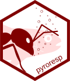

<!-- Jump to [**installation instructions**](#installing-actel) -->

# pyroresp

<!--  -->
<!--  -->

<!--  of non-interactive code* -->

Read the [latest news here!](https://github.com/hugomflavio/pyroresp/blob/master/NEWS.md#news)

## Overview

pyroresp is a rapidly evolving R package. Its objective is to simplify the data analysis process for intermittent-flow respirometry data collected using pyroscience loggers (firestings).

Note: This package was originally forked from the FishResp R package (https://github.com/embedded-sergey/FishResp-Rpackage) and has since grown to become a sibling of FishResp.
