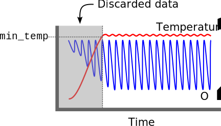
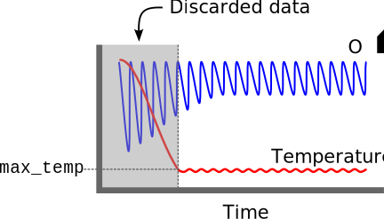

Welcome to pyroresp! This vignette will show you how to organize your data and which functions to use for each situation.

**Note:** Reading this before conducting experiments will make your life incredibly easier later on.

There are two main types of datasets in intermittent-flow respirometry: background readings, and metabolic rate readings. Sometimes, researchers also run a background chamber in parallel with their animals; which is something pyroresp can deal with as well.

## Important notes:

pyroresp builds on/relates to the work of other people. Those relationships
should be acknowledged:

1. pyroresp originated as a fork of the R package [**FishResp**](https://github.com/embedded-sergey/FishResp-Rpackage), and only became an independent unit with the agreement of FishResp's author. While the two source codes have diverged greatly over time, some remnants of similarity can still be found here and there.
2. The standard/routine metabolic rate calculation methods used in pyroresp are an adaptation of the appendix provided by Chabot et al ([**2016**](doi.org/10.1111/jfb.12845)) in their paper "The determination of standard metabolic rate in fishes." This is a great paper by the way; if you haven't read it yet, I recommend doing so before you start running your own respirometry experiments.
3. While pyroresp's name shares a similarity with the pyroscience company (for the obvious reason that this package is meant to process the output of their loggers), pyroresp is not affiliated with pyroscience, and pyroscience is not responsible for any functionalities or consequences of using this package.


## Expected input data

Regardless of if you are importing a background or metabolic rate dataset, the input files should be organized in the same fashion. For the most part, the default file organization out of the workbench software is what you need. You will also want to have a file keeping track of the chamber phases inside the folder of the experiment. Here's an example of how your data folder should look like:

<pre>
- 2024-03-13_091010_pre_bg
  |- ChannelData
  |   |- Comments
  |   |- <b>A_Firesting Pro (4 Channels)_(A CH.1)_Oxygen.txt</b>
  |   |- <b>A_Firesting Pro (4 Channels)_(A CH.2)_Oxygen.txt</b>
  |   |- <b>A_Firesting Pro (4 Channels)_(A CH.3)_Oxygen.txt</b>
  |   |- <b>A_Firesting Pro (4 Channels)_(A CH.4)_Oxygen.txt</b>
  |   |- <b>A_Firesting Pro (4 Channels)_(A T1)_TempPT100Port.txt</b>
  |   |- StatusLegend.txt
  |- 2024-03-13_091010_pre_bg.pyr
  |- 2024-03-13_091010_pre_bg.txt
  |- <b>Phases_file_A.txt</b>
</pre>

The files highlighted in bold are the ones relevant for pyroresp; namely the raw data files and the phases file. Note that your phases file name should contain something that makes it clearly distinguishable from the remaining text files present in the data folder (e.g. include the name "Phases"). It should also end with the name of the firesting device it relates to, preceded by an underscore (note: this is not the "A" displayed on the raw data file names).

### Where is my device name and how do I rename it?
On the left side of the workbench software you will find squares representing each device. The name of the device is indicated in the top left corner of each device. Change the device name to something **simple and without spaces**, so that renaming those phases files is an easy task. A simple letter such as "O" is a good device name.

### What if I have more than one firesting plugged in?
Then you must keep track of the device names and ensure you have one (and only one!) phases file for each device. Try to avoid ending device names in a number (such as "O1"), as that would generate  potentially confusing probe names (e.g. probe "1" of device "O1" would be named "O11"). Like before, include the device name at the end of the phases file name, preceded by an underscore. E.g. if you have named your devices "A" and "B", then your data folder must have a "Phases_file_A.txt" and a "Phases_file_B.txt."

### I already ran my experiment and didn't rename the device! What can I do?
The default names for the firesting loggers are rather long, so you should still rename your devices. You may use the function `assign_device_names()` to rename the devices of an already-completed experiment. The workbench software assigns a letter to each device (A, B, etc). You can use this letter as a reference to have your device renamed. E.g. if device A is currently named "Firesting O2" and you wanted to rename it to "O", you would do the following:

```r
assign_device_names(folder = "2024-03-13_091010_pre_bg",
                    assign_list = list(A = "O"))
```

Note that running the code above would only do a dry-run of the changes. This is to ensure users don't accidentally modify their files without wanting to. Running the function like this will display which changes _would have been applied_, if the function were to proceed. If you are happy with what is displayed, run the function again, but this time include the argument `confirmed = TRUE`.

You can rename multiple devices in one go by adding more elements to the list. E.g. `list(A = "O", B = "P")` would rename devices A and B.

**Note:** Which device gets assigned each letter depends on the order by which they were plugged in and the internal USB port numbers in your computer. This means they may not always be assigned the same letter as the experiment progresses! It is safer to rename the devices _before_ you start your experiments. Those names get recorded in the device itself, and will be consistent throughout the experiment.


### Additional probe information
Finally, for your metabolic rate dataset, you will also need a data frame containing pertinent information for each probe. This data frame should contain the following columns:

- **id**: The ID of the animal
- **mass**: The mass of the animal, in grams
- **volume**: The non-corrected volume of the chamber + tubing
- **probe**: The device-channel combination for the probe
- **first_cycle**: The first cycle of valid data for that animal

**Note:**

- The probe column should contain the device name and the probe. I.e. the first probe from device "O" should be referred to as probe "O1."
- The column names of this dataframe should be in lower-case only.

### load_experiment()

Once you have setup your data following the above, you are reading to load it in. For this, you can use the first wrapper provided by pyroresp; the function `load_experiment()`:

```r
pre_bg <- load_experiment(folder = "2024-03-13_091010_pre_bg", 
                          date_format = "%d-%m-%Y", 
                          tz = Sys.timezone(),
                          phases_file = "Phases",
                          fix_phases = TRUE)
```

**Notes:**

- The **`date_format`** may depend on your settings. To check how the dates are being stored, you can open one of the raw data files highlighted in the schematic above and scroll down to the actual data. The dates will be the first column.
- **`tz`**: The timezone of the collected data. this is important to ensure diel cycles are captured correctly, especially if you are planning on pairing this data with other, external sources of data.
- **`phases_file`**: A word that identifies the phases files. In the example above, I named it "Phases_file_A.txt," so setting this argument to "Phases" allows R to match only the phases files.
- **`fix_phases`**: Sometimes, pump controllers skip or overlap a second here and there. This is more likely to happen if the controller doesn't have an internal absolute clock. This argument defaults to TRUE and automatically corrects and gaps/overlaps found in the data. If the file contains repeated phase names, this will also fix that by renaming every phase from 1 onward. 

<!-- You can find more about the output of `load_experiment()` in [**here**](outputs.html/load_experiment). -->

### Assigning units

pyroresp makes use of the package [units](https://cran.r-project.org/package=units) to assign units to the various variables at work. This ensures that all conversions are properly made and respected when making calculations between columns (e.g. dividing a umol/L column with a hour column will result in a umol/L/h column). It also prohibits calculations between columns that are not compatible (e.g. subtracting grams to litres), compelling the users to think about these operations before conducting them.

**Tip:** You can use the `conv_w_to_ml()` function to help you convert weight data to volume using a specified density.

## Preliminary data processing

Once your data has been loaded in, there are a few processing steps that must occur before you can move on to calculate background or metabolic rates. Namely:

### 1) Merging the pyro data and the phases

This is done based on the device names and the timestamps. This is why it is important to make sure your device names are correct in your data folder. If something isn't right, pyroresp will let you know.

### 2) Melting the data into a computer-friendly format

The initial dataset has an oxygen, temperature, pressure, and phase column for each probe (e.g. Ox_O1, Ox_O2, etc.), all organized by time. While this makes manual inspection of the data over time easier, it is not a very friendly format. After assigning the phases to each probe, pyroresp will then melt your tables so that each variable (oxygen, temperature, etc) is nicely collated in a single column, and the output is easily usable by e.g. ggplot2.

### 3) Discarding non-relevant readings

A good part of the oxygen readings we obtain during a respirometry trial are not really relevant for metabolic rate calculations. These correspond to the flush phases, and the desired wait time (i.e. the beginning of each measurement phase). In this step, pyroresp discards all of that, and saves the cleaned data frame into a new object.

### 4) Calculate air saturation and convert O2 units

One of the things people are usually interested in knowing is the percentage air saturation of oxygen in the chambers over time. As such, pyroresp creates a new column called airsat with this information. It is also here that pyroresp will automatically convert the raw oxygen data into the unit you desire to use for your results (more details below).

### 5) Calculate oxygen deltas

Now that the data is all clean and in the right units, pyroresp will calculate the delta in oxygen along time for every cycle. This is done by grabbing the very first measurement value and subtracting it to all recorded values (i.e. the phase starts at 0 and gradually dips into the negatives).

### 6) Discarding phases based on user request

You can make use of several arguments to discard specific parts of the data. This is the last step of the pre-processing pipeline. You can read more about the options below.


### process_experiment()

All the steps detailed above have been organized into a wrapper function called `process_experiment()`. Here's how it works:

```r
pre_bg <- process_experiment(input = pre_bg, 
                             wait = 30, 
                             convert_o2_unit_to = "umol_per_l",
                             patch_NAs = TRUE, 
                             patch_method = "linear",
                             min_temp, max_temp, 
                             start_time, stop_time, 
                             from_cycle, to_cycle, 
                             verbose = TRUE)
```

There is a lot going on in there. Let's break it down.

1. Provide the output of `load_experiment()` into the first argument (`input`).
2. Define the number of seconds that should be removed from the beginning of the measurement phases (i.e. the wait period)
3. If you wish to convert the oxygen values to a unit different from that which was recorded by the devices, now is the only time you can easily do it. Define your desired unit in the `convert_o2_unit_to` argument. These are all the acceptable options: "hPa", "kPa", "torr", "mmHg", "inHg", "mg_per_l", "ug_per_l", "umol_per_l", "mmol_per_l", "ml_per_l", "mg_per_kg", "ug_per_kg", "umol_per_kg", "mmol_per_kg", "ml_per_kg"
4. Sometimes there are small patches of NAs scattered in the respirometry data. This can happen because something went wrong with the device connection, or perhaps your sampling interval is so short that the computer's processor ended up missing a value here and there. These may cause trouble if you want to use rolling average methods, and may cause undesirable breaks in your plots. If these gaps of NAs are small (n <= 5), then you can ask pyroresp fix them for you using one of the three available methods ("linear", "before", or "after") using the `patch_method` argument. Learn more about these methods by running `?process_experiment`.
5. The `min_temp`, `max_temp`, `start_time`, `stop_time`, `from_cycle`, `to_cycle` provide you with different methods to trim the data which will be used to calculate the metabolic rates.
    - `min_temp` should be used when your system starts at a temperature that is lower than your temperature of interest. As the temperature increases, all phases that end before the minimum acceptable temperature is reached are discarded. Note that once your minimum acceptable temperature is reached, all subsequent data will be kept (even if the temperature drifts down again).
    - `max_temp` should be used when your system starts at a temperature that is higher than your temperature of interest. As the temperature decreases, all phases that end before the maximum acceptable temperature is reached are discarded. Note that once your maximum acceptable temperature is reached, all subsequent data will be kept (even if the temperature drifts up again).
    <div style="text-align:center">
      
       
    </div>
    - `start_time`  should be a timestamp in `yyyy-mm-dd hh:mm:ss` format. Any phases that end before this timestamp will be excluded.
    - `end_time`  should be a timestamp in `yyyy-mm-dd hh:mm:ss` format. Any phases that start after this timestamp will be excluded. 
    - `from_cycle` should be used to remove any cycles prior to the value specified
    - `to_cycle` should be used to remove any cycles after the value specified.
6. The `verbose` argument determines if progress messages should be sent. Unless for very specific cases, it is a good idea to keep this `TRUE`.  


<!-- You can find more about the output of `process_experiment()` in [**here**](outputs.html/process_experiment). -->


Now that your data is processed, the next steps will depend on if you are working with background data or metabolic rate data. Let's start by looking into the background data steps.

## Processing the background data

Your processed object contains everything you need to swiftly calculate the background rates. For that, you'll use the `calc_bg()` function:

### linear method

```r
pre_bg <- calc_bg(input = pre_bg)
```

If you run `calc_bg()` without specifying a smoothing value, pyroresp will fit a linear model to the delta O<sub>2</sub> values over time and calculate the respective background consumption for each second of the cycle. Note that the intercept of these linear models is forced to be 0, so the fitted line might be slightly below or above the readings if there is some initial deviation in the delta.

**Tip:** You can use the argument `method` to choose between using all the cycles ('mean'), or only either the 'first' or the 'last' cycles. You can also remove specific phases (see `remove_phase()` below).

### rolling-average method

```r
pre_bg <- calc_bg(input = pre_bg,
                  smoothing = 30) # in seconds
```
If you prefer, you may use a rolling average to calculate a smoother background reading. This method may follow your readings more closely than the linear method if there is a _small_ but consistent deviation from the 0 intercept.

### plot_bg()

After running `calc_bg()`, plotting the background is easy.

```r
plot_bg(input = pre_bg,
        linewidth = 1.5)
```

You can also use the `probe` argument to plot only a specific probe.

**Note:** Save from the normal variability of the probe values going up and down around the true oxygen value, your background should be generally linear! This means that both the linear method and the rolling-average method should yield similar results! If there are patterns in your background readings, then something is wrong in your setup! 
Some common issues: 

- A decrease in slope over time (i.e. the trace flat-lines overtime) is usually a sign of a broken/poorly closed chamber/tubing allowing new water to seep into the chamber during a measurement phase.
- A very steep slope in comparison to the remaining probes may indicate that the recirculation pump for that chamber is not working (assuming the chambers are properly clean).
- A trace going generally down but wobbling greatly may be a sign of poor mixing in the chamber, or of mal-functioning oxygen probe.
- A trace going up instead of down may be a sign of residual cleaning liquids (e.g. residual peroxide) still in the chamber/tubing. These substances may stick quite hard to surfaces and take hours of flushing to fully clear out.
- An instantaneous drop/rise in O<sub>2</sub> concentration may indicate either a pressure change (e.g. the flush pump turning off), or a grounding issue in one of the pumps affecting the temperature probe. The former may not be problematic if it happens during flush. If the latter, ground the water bath to minimize the interference.


### Can I remove phases that are off and affecting my background?

You can remove phases that for some reason are weird using the `discard_phase()` function. Remember that you will have to re-run `calc_bg()` after removing the bad data.

```r
pre_bg <- discard_phase(input = pre_bg,
                        probe = "A1",
                        phase = "M1")
```

**Note:** You may run `discard_phase()` several times in sequence to remove different combinations of probes and phases.


### Can I copy backgrounds between probes to save a ruined background reading?

If you are confident that the background of one probe should be similar to that of another, then you may use `replace_bg()` to override the background readings:

```r
pre_bg <- replace_bg(input = pre_bg,
                     replace = "A2",
                     with = "A1")
```

Do not perform this action lightly. This is a last resort action that should only be performed if you are **very confident** on what the background should be. The best option here is always to keep an eye on the background run as it is running and to re-run it if something looks off.

### How do I extrapolate background readings to fit longer measurement phases?

Because pyroresp calculates the right background reading for each second of the phase right away, it won't be able to fit measurement phases that are longer than the phase times used for background readings. This can be a problem for manually extended phases.

If you have any measurement phases in your metabolic rate data that span longer than your background phases, you can expand your background using the `extrapolate_bg()` function.

```r
pre_bg <- extrapolate_bg(input = pre_bg,
                         to = 3600) # in seconds
```

**Note:** pyroresp will automatically trim measurement phases to the length of the background readings. If you have long phases, remember to extrapolate your background before subtracting the background!


### What should I do if I have pre- and post-background?

Process both as separate objects following the methods outlined above. You'll want to have both background objects ready to process the metabolic rate data.

### What if I used an empty chamber as the background control?

Then you can skip these steps, you will be given an opportunity further down to tell pyroresp to use a probe as the background of the remaining.


## Subtracting background from metabolic data

Since we've been talking about background for a while, let us assume we are only now loading our metabolic rate data. The first two steps are again to `load_experiment()` and `process_experiment()`. Note that, this time, I will want to have a data frame containing the required columns as listed [here](workflow.html/additional-probe-information). That data frame goes into the `probe_info` argument of `load_experiment()`.

```r
bio <- data.frame(id = c("fish1", "fish2", "fish3", "fish4"),
                  mass = c(2.1, 1.3, 2.3, 1.7),
                  volume = rep(43, 4),
                  probe = c("O1", "O2", "O3", "O4"),
                  first_cycle = rep(1, 4))

run <- load_experiment(folder = "2024-03-13_091512_run", 
                       date_format = "%d-%m-%Y", 
                       tz = Sys.timezone(),
                       phases_file = "Phases",
                       probe_info = bio)

run <- process_experiment(input = run, 
                          wait = 30, 
                          convert_o2_unit_to = "umol_per_l")
```

Alright, we are back up to speed. Now, we will want to subtract the background from the calculated deltas. To do that, you should run `subract_bg()`:

### subtract_bg()

For example, if you only had recorded background at the start, you would run this:

```r
run <- subtract_bg(input = run,
                   pre = pre_bg,
                   method = "pre")
```

If you have recorded background both at the start and at the end of the experiment, then e.g.:

```r
run <- subtract_bg(input = run,
                   pre = pre_bg,
                   post = post_bg,
                   method = "linear")
```

If you used an empty chamber in parallel to record background, then e.g.:

```r
run <- subtract_bg(input = run,
                   method = "parallel",
                   ref_probe = "O4")
```

These are the possible `method` values:

- `pre`: subtracts the pre-experiment background readings from the experiment oxygen consumption readings.
- `post`: subtracts the post-experiment background readings from the experiment oxygen consumption readings.
- `average`: averages the pre- and post-experiment background readings and subtracts them from the experiment oxygen consumption readings.
- `linear`: calculates a linear progression between pre- and post-experiment background readings and subtracts the respective background from the experiment oxygen consumption readings, using the cycle number as an indicator of the position in the linear progression.
- `parallel`: subtracts the oxygen consumption readings of one probe (listed using `ref_probe`) from the remaining probes, matching both by cycle.
- `none`: does not perform oxygen consumption subtraction. Not recommended for anything other than checking dummy data and debugging.

**Note:** You must pass your data through `subtract_bg()` before the next step, even if you choose the option "none".

## Processing the metabolic rate data

You are now ready to pass your data through the next wrapper function, `process_mr()`. This function will complete the following steps:

### 1) Calculate linear slopes

By fitting linear models to the cleaned, corrected oxygen readings. The R2 of these models is also extracted

### 2) Filter slopes by threshold R2

By default, models with an R2 lower than 0.95 are excluded from further calculations. You can find how to change this threshold below.

### 3) Calculate ṀO<sub>2</sub>
The good slopes are then converted into ṀO<sub>2</sub> using the following formula:

$\dot{M}O_2 = \frac{S * (V - M)}{M}$

Where:

- $S$ = Corrected slope
- $V$ = Water volume of the chamber and tubbing
- $M$ = Animal mass, assuming 1:1 density.

### 4) Calculate the SMR

This step uses the various methods presented by [Chabot et al (2016)](doi.org/10.1111/jfb.12845) to calculate different SMR values. Namely, you may calculate the mean of the lowest normal distribution (MLND), different quantiles, the average of a given percentage excluding 5 outliers, or simly use the lowest n<sup>th</sup> value. You can find out how to tweak (or skip) these below.

### 5) Extract the MMR

Lastly, pyroresp will find the cycle which recorded the highest ṀO<sub>2</sub> for each probe, and copy those cycles into a separate table.


### process_mr()

All the steps outlined above are carried on by `process_mr()`. It works as follows:

```r
run <- process_mr(input = run, 
                  r2 = 0.95, 
                  G = 1:4, 
                  q =  c(0.2, 0.25),
                  p = 0.1, 
                  n = 10)
```

There are a few things you can tweak in this function. Let's break it down.

1. `r2` sets the minimum R2 threshold required for a slope to be considered good. Set to 0 to calculate ṀO<sub>2</sub> for all slopes.
2. `G` sets the number of clusters the MLND method may use. The default (and recommended) is `1:4`. Set to `NULL` to skip the MLND method of SMR calculation.
3. `q` sets the quantiles for the quantile SMR method. Set to `NULL` to skip the quantile method of SMR calculation.
4. `q` sets the proportion breakpoints for the percentage SMR method. This method excludes the 5 lowest values as potential outliers. Set to `NULL` to skip the percentage method of SMR calculation.
5. `n` sets the n<sup>th</sup> lowest ṀO<sub>2</sub> value to be considered the SMR for the lowest n SMR calculation method. Set to `NULL` to skip the lowest n method of SMR calculation.

All of `q`, `p`, and `n` may take the form of a vector to calculate multiple endpoints for their respective methods. Again, for more details on how these work, I recommend reading [Chabot et al (2016)](doi.org/10.1111/jfb.12845).


<!-- You can find more about the output of `process_mr()` in [**here**](outputs.html/process_mr). -->


## Plotting the output of your experiment

There are two main tools you may use to plot the more important aspects of your experiment. The first one plots a summary of the data for a given probe, and the second one plots the distributions of ṀO<sub>2</sub> vales and the respective SMR for the different methods used.

### plot_experiment()

To see how your data evolved from raw oxygen detections to your calculated ṀO<sub>2</sub> values, use `plot_experiment()`:

```r
plot_experiment(input = run, probe = "A1")
```

Because `plot_experiment()` returns a rather complex plot, you may only plot one probe at a time. You can also use the argument `cycles` to plot only a subset of the total run (e.g. in case you want to inspect a specific section of the data in more detail).


### plot_smr()

you may also see in more detail the distribution ṀO<sub>2</sub> vales and the respective SMR values which originated from them. For that, use `plot_smr()`:

```r
plot_smr(input = run)
```

This will plot the SMR of the four probes. You may use the `probes` argument to subset the probes that should be plotted.


## Obtaining rolling MO2 for a given cycle

Now that you have completed the analysis of your data, you might find yourself wanting to explore a given cycle in more detail. This is very common for MMR cycles, for example, where the ṀO<sub>2</sub> calculated for the whole cycle may be an underestimation of the true peak ṀO<sub>2</sub>. This is because the animal is already calming down as the cycle progresses, so the oxygen consumption might be considerably different at the start and at the end of the cycle. This is when you want to calculate a rolling metabolic rate within the cycle itself.

### roll_mr()

To do that, you'll want to use the function `roll_mr()`:

```r
run <- roll_mr(input = run, 
               probe = "A1", 
               cycle = 1,
               smoothing = 30)
```

All you have to do is choose the probe and cycle you want to roll out. Note that you can only select a probe and a cycle at a time, but you can run this function several times on your output to obtain rolling metabolic rates for multiple probe and cycle combinations. Note that this function will also pick the highest recorded value within the cycle for you.

<!-- You can find more about the output of `roll_mr()` in [**here**](outputs.html/roll_mr). -->

### plot_rolling_mr()

To see the result of `roll_mr()`, run `plot_rolling_mr()`:

```r
plot_rolling_mr(run)
```

As usual, you can use `probes` or `cycles` to subset the rolling results you'd like to see. If you want to see them all, just run the function as shown above.

### Can I remove a part of a rolling ṀO<sub>2</sub> that is clearly an artifact?

If your probe had a hiccup during a measurement phase that produced a clearly erroneous rise/drop in the oxygen readings mid-measurement phase, that will have a strong impact on your rolling metabolic rate calculations, which should become very evident when you plot your data using `plot_rolling_mr()`. If that is the case, than you can ask pyroresp to exclude an interval of the rolling data, and recalculate the maximum metabolic rate recorded during the cycle. For that, use `exclude_rolling_mr_segment()`:

```r
input <- exclude_rolling_mr_segment(run,
                                    probe = "A1",
                                    cycle = 1,
                                    from = 50, # in seconds
                                    to = 70) # in seconds
```

Plot the data again to see the result.


### This manual didn't help me find what I need? What now?

If you are trying to do something that is not in this manual, odds are it that functionality is not available right now. You are welcome to submit an issue to the package github repository to get the discussion going on what you need to do and why. Here: [pyroresp's issue page](https://github.com/hugomflavio/pyroresp/issues).


